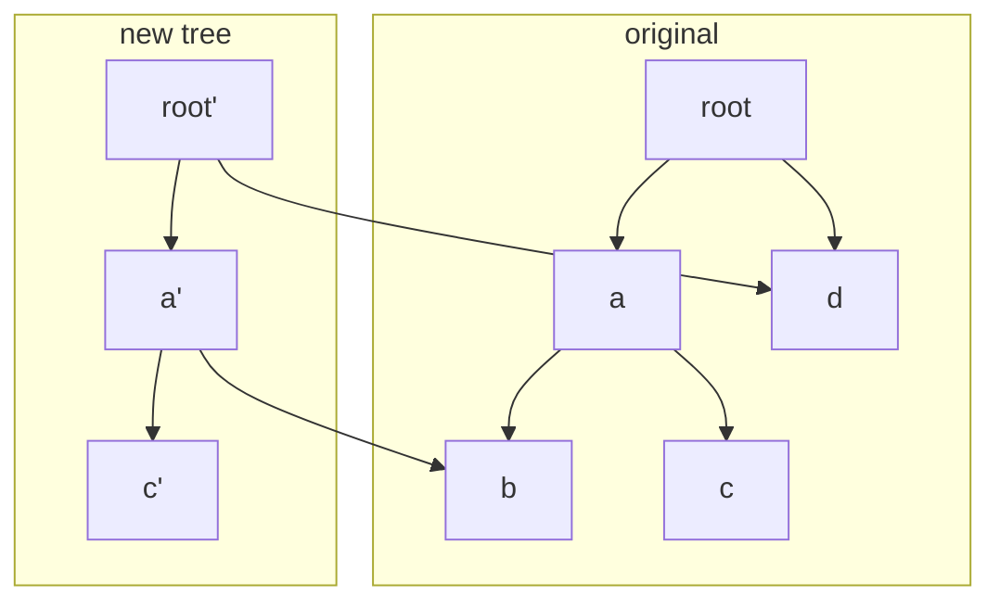
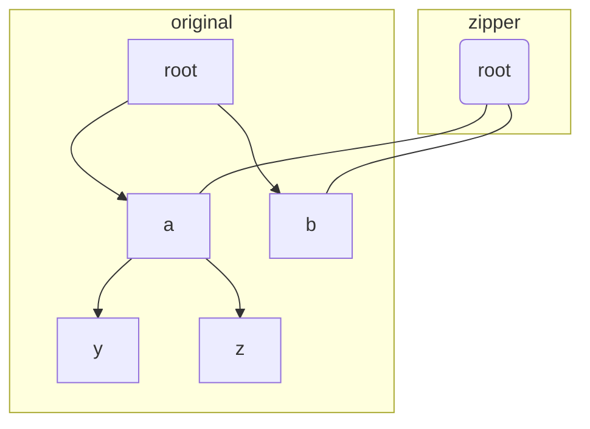
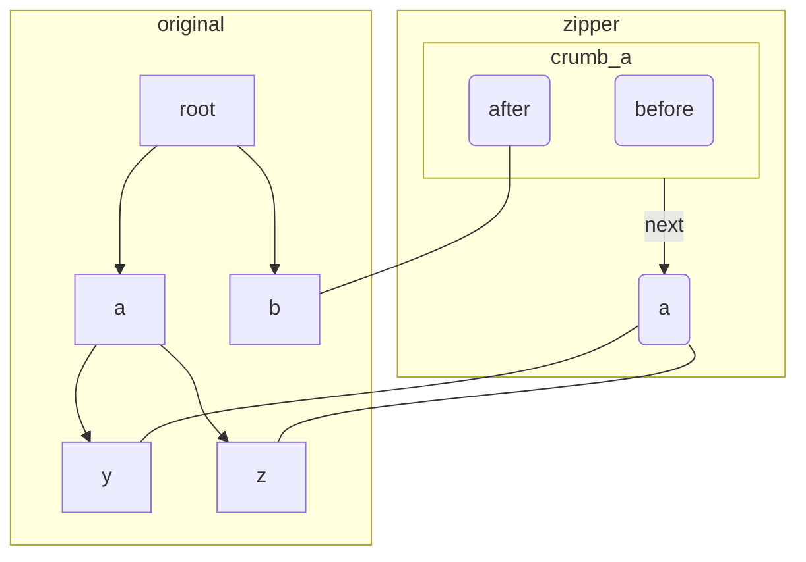
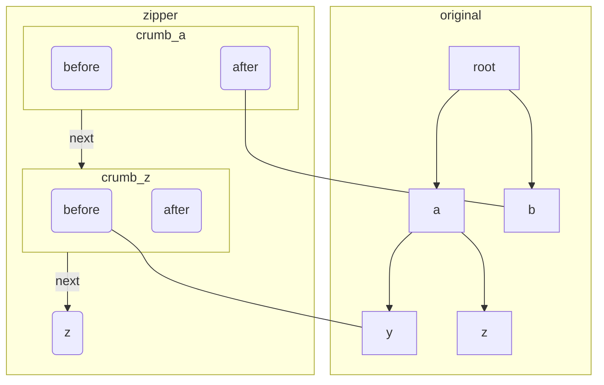
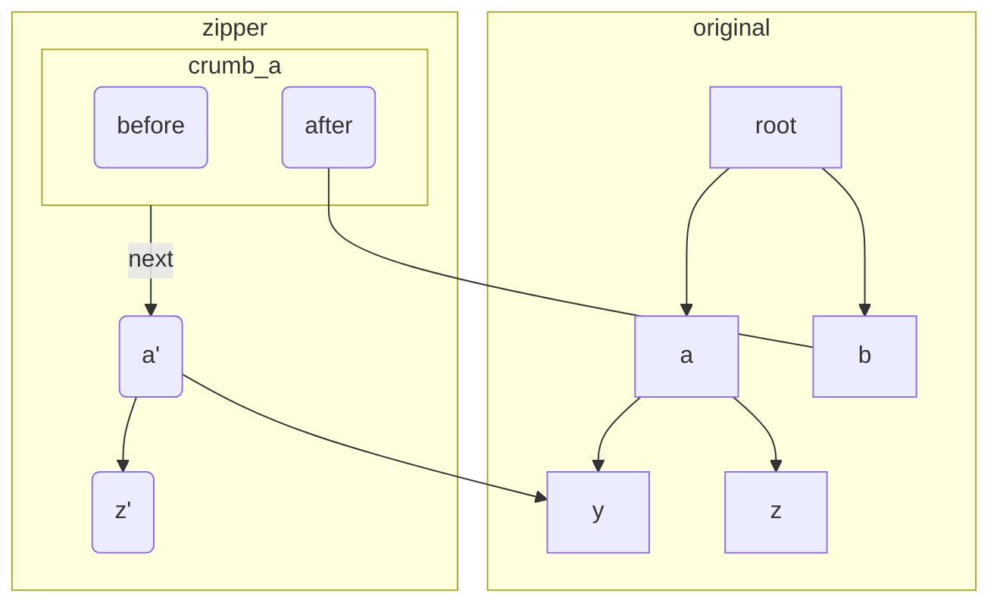
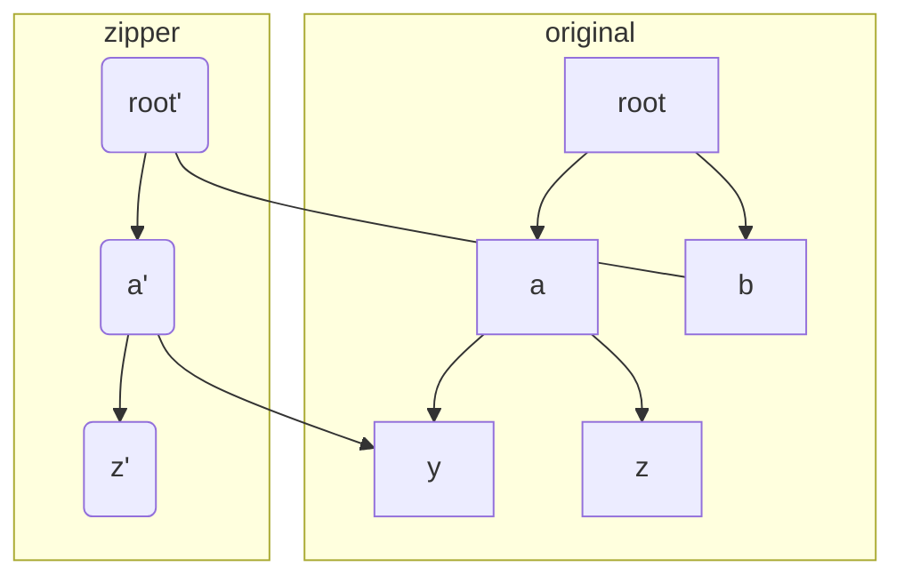

# Understanding Zippers

When working with tree data structures, we often need a **cursor** that allows us to navigate the tree—for example, moving to a parent node or to a specific child.

## Imperative languages

In imperative languages such as Go, if the Tree is defined with a parent pointer, then the implementation is straightforward.

```go
type Cursor interface {
	goUp() Cursor
	goDown(name string) Cursor
}

type Tree struct {
	Children map[string]*Tree
	Parent *Tree
}

func (c *Stack) goUp() Cursor {
	return c.Parent 
}

func (c *Stack) goDown(name string) Cursor {
	return c.Children[name]
}
```

If the Tree does not have a parent pointer, we can use a stack to record the ancestor nodes.

```go
type Tree struct {
	Children map[string]*Tree
}

type Stack []*Tree

func (c *Stack) goUp() Cursor {
	*c = (*c)[:len(*c)-1]
	return c
}

func (c *Stack) goDown(name string) Cursor {
	cur := (*c)[len(*c)-1]
	*c = append(*c, cur.Children[name])
	return c
}
```

## Functional languages

In functional languages, especially Haskell, it is extremely hard to build a doubly linked list or a Tree with parent pointer. The plausible approach to implement `Cursor` is the stack approach, storing the ancestor information.

```haskell
data Tree a = Leaf a | Tree [(String, Tree a)]
  deriving (Show)
```

One key difference is that the `Tree` we implemented in Haskell is persistent (immutable), meaning that each modification creates a **new tree**, while the unchanged parts of the original tree are reused.

The following diagram illustrates how updates work in a persistent data structure. Suppose we wanted to modify node `c`.



The Zipper is defined as follows:

```haskell
data Zipper a = Zipper (Tree a) [Crumb a]
  
data Crumb a = Crumb
  { key :: String
  , before :: [(String, Tree a)]
  , after :: [(String, Tree a)]
  }
```

A `Zipper` consists of:
- the **currently focused subtree**
- a list of **breadcrumbs** describing the path back to the root.

`Crumb` looks like a `Tree`, except for one `Tree` is taken away, which indexed by `key` in the original Tree. The `before` stores all its siblings that are before the key in the original `Tree`'s children. The `after` stores all siblings after the key.


```haskell 
goUp :: Zipper a -> Zipper a
-- insert (key, t) before r and append the list to the l to reassemble the Tree's children list.   
goUp (Zipper t (Crumb key l r : bs)) = Zipper (Tree (l ++ (key, t) : r)) bs
goUp (Zipper _ []) = error "Already at the top"
```
To go upward, we take the top tree of the Zipper, reassemble the parent tree by filling the hole with the top tree, pop the crumbs and make the reassembled parent tree as the new top.

```haskell

goDown :: String -> Zipper a -> Zipper a
-- break breaks the children list to two lists. The first list does not have any key. The first element of the second list is the (key, tree).
goDown k (Zipper (Tree ts) bs) = case break ((== k) . fst) ts of
  (_, []) -> error "No such child"
  (l, (_, v) : r) -> Zipper v (Crumb k (l ++ r) [] : bs)
goDown _ (Zipper (Leaf _) _) = error "Cannot go to child of a leaf"
```

Moving downward **creates a hole in the parent node**. The removed node becomes the new top.

## Simulation of navigating a persistent tree


1. Create a zipper at root.



**2**. goDown "a"



3. goDown "z"




4. modify z


5. goUp



6. goUp



