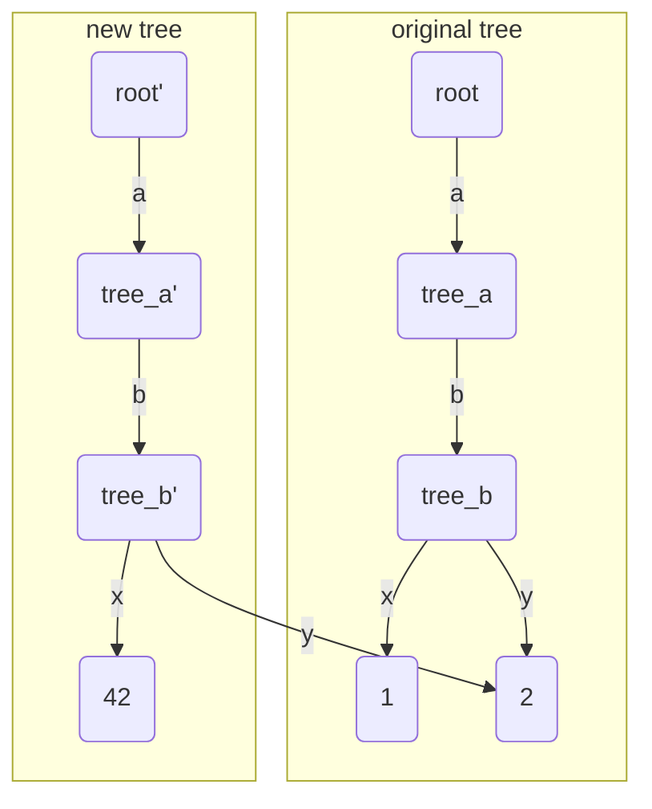
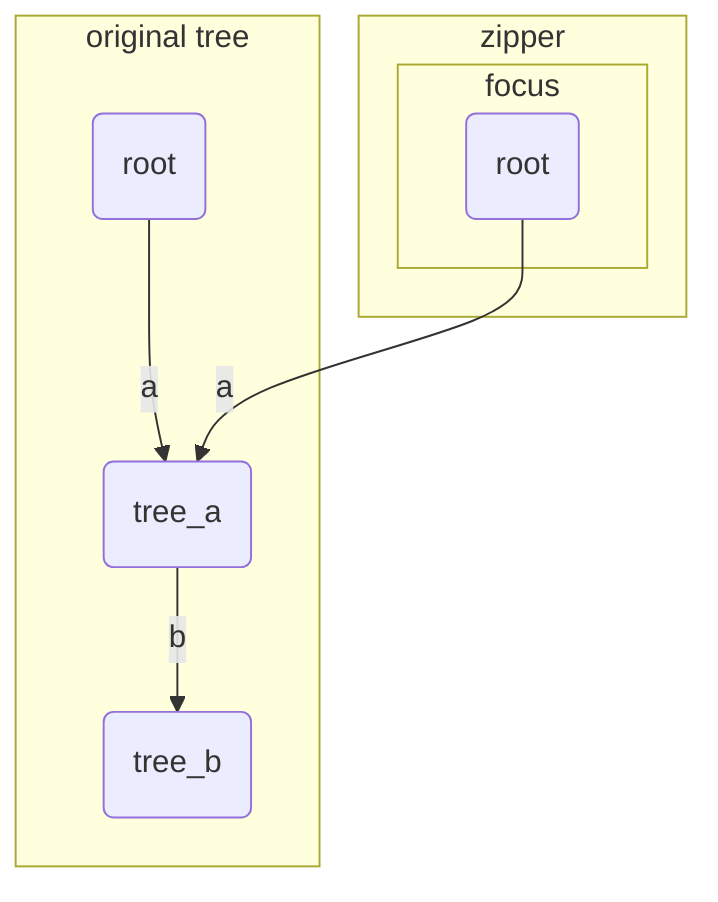
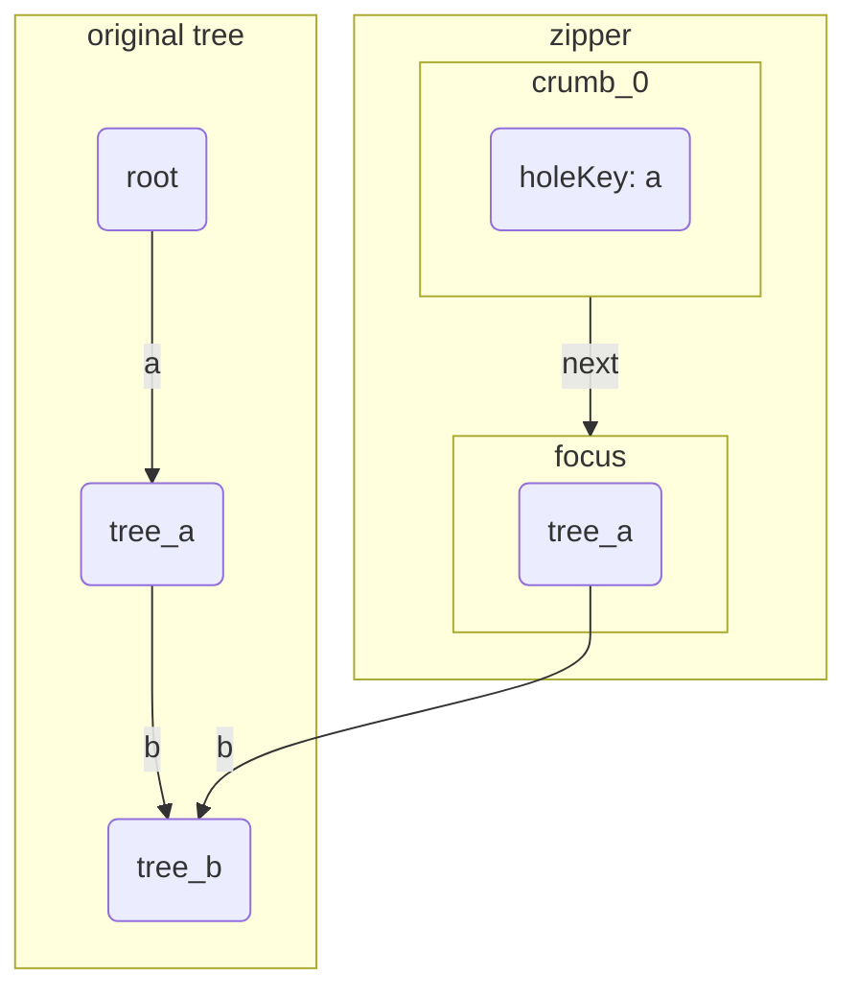
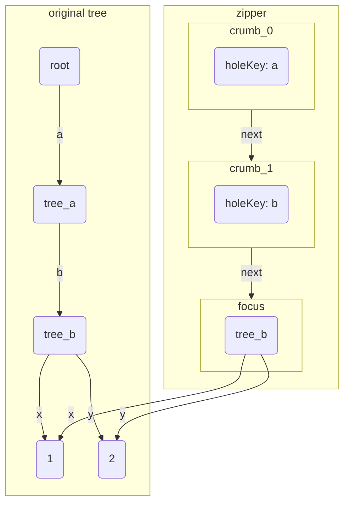
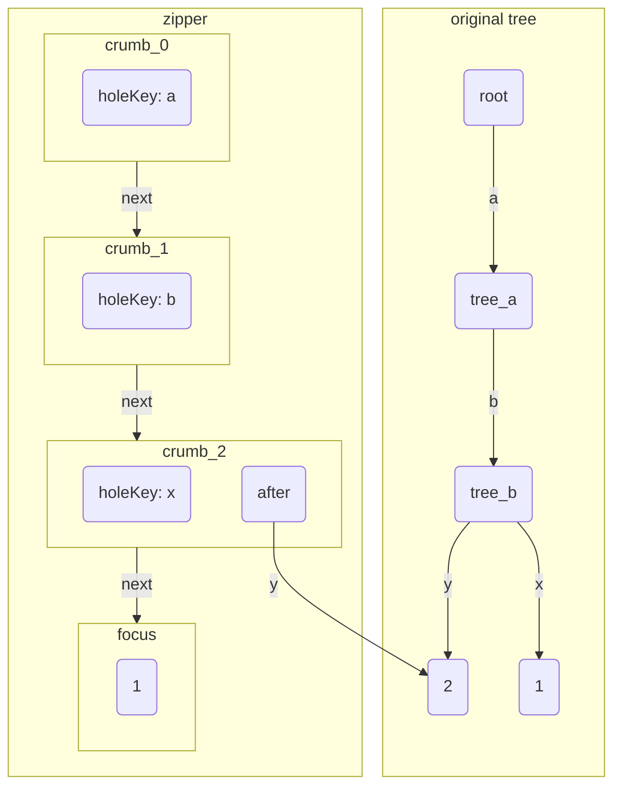
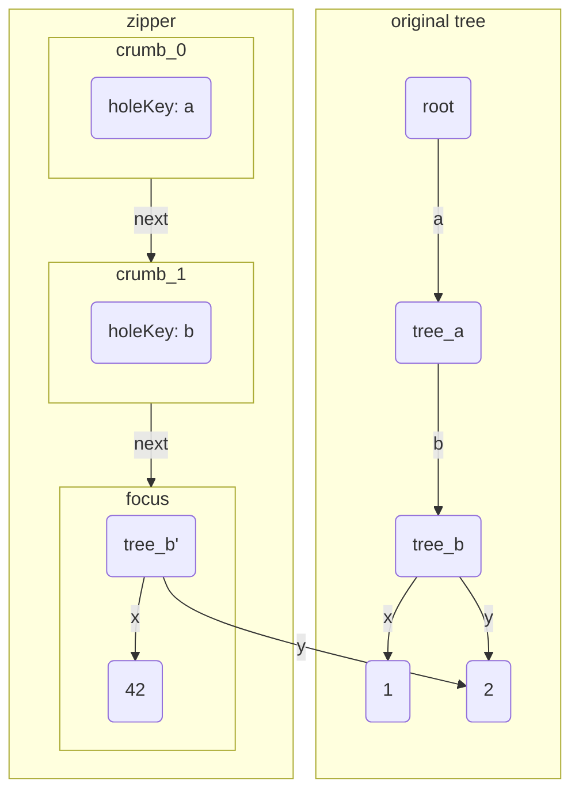

When working with tree-structured data, we often need to navigate to a specific node and modify it. In imperative languages, this is usually straightforward thanks to mutable state and parent pointers. In functional languages, however, immutability makes this pattern less obvious.

In this post, we’ll explore how to navigate and modify tree structures efficiently in functional languages using a technique called **zippers**.

## Simple JSON query language

Suppose we are implementing a simple JSON query tool with syntax similar to `jq`. The language allows us to access and modify values in a JSON object.

The core syntax:

* `.field` — access a field
* `=` — replace the current value
* `|` — chain operations
* `with_cursor($=filter, $cursor_movement)` — create a cursor at the node specified by `filter` and execute `query` with the
  cursor as the root node. The `cursor_movement` is:
  * `.field` — access a field relative to the current cursor node.
  * `.^` — access the parent node of the current cursor node.

In an imperative setting, we might represent the JSON as a tree with parent pointers, making navigation (both downward and upward) trivial.

In a functional language like Haskell, we generally avoid parent pointers because maintaining them correctly under immutability is difficult. Instead, we need a different approach.

### Example

Suppose we have the following JSON object:

```json
{
  "a":{
    "b":{
        "x":1,
        "y":2
    }
  }
}
```

We have the following two queries that do the same thing but with different syntax:

```
.a.b.x = 42 | .a.b.y = 43

with_cursor($=.a.b, $.x = 42 | $.y = 43)
```

We will use the example to explain how to implement the query language in Haskell, and how to use zippers to navigate
and modify the tree data structure efficiently.

## Navigating and Modifying Trees

### Persistent data structure

In Haskell, data structures are typically immutable. To modify a node in a tree, we need to create a new tree that
contains the modified node, while sharing the unchanged nodes with the original tree. This is known as a **persistent
data structure**.

We define a minimal tree type:

```haskell
data Tree
  = Atom Int
  | Object [(String, Tree)]
```

Example value:

```haskell
root :: Tree
root = Object [("a", Object [("b", Object [("x", Atom 1), ("y", Atom 2)])])]
```

### First Approach: Root-based


The first query `.a.b.x = 42 | .a.b.y = 43` can be implemented by accessing the target node and modifying it, then
accessing another target node through the modified root node and modifying it again.

To access a node, we recursively follow the path from the root to the target node and recursively create new nodes along
the way. The unchanged nodes are shared between the original tree and the new tree. The number of nodes that are
modified by the `access` function is `O(depth(node))`, where `depth(node)` is the depth of the target node in the tree.

```haskell
access :: [String] -> (Tree -> Tree) -> Tree -> Tree
access [] f t = f t
access (k : ks) f (Object ts)
  | let (before, rest) = break ((== k) . fst) ts
  , ((_, v) : after) <- rest =
      let modifiedChild = access ks f v
       in Object (before ++ (k, modifiedChild) : after)
access _ _ _ = error "Invalid path to access"
```

When the path is empty, we apply the modification function f to the current node. Otherwise, we find the child with
key k, recurse into it with the remaining path, and rebuild the current node with the modified child. The cost is
O(depth(node)) new nodes per modification.

#### Example of `access`

Suppose we modify the "x" node to 42 with `access ["a", "b", "x"] (const $ Atom 42) root`, the new tree and the original
tree would look like the following:



In the diagram, the `tree_a` stands for a `Tree` node that is a child of the root node with key "a". The `tree_a'` is a
modified version of `tree_a` with the modified child node "x". The `root'` is a modified version of the original root
node with modified nodes. So is `tree_b'`.

From the diagram, we can see that the modified node "x" is a new node with value 42, and its parent node "b" is also a
new node that shares the unchanged child node "y" with the original tree.

#### Query execution

The whole query can be translated to the following Haskell code:

```haskell
( access ["a", "b", "x"] (const $ Atom 42)
. access ["a", "b", "y"] (const $ Atom 43)
)
  root
```

`.a.b.x = 42` is translated to `access ["a", "b", "x"] (const $ Atom 42)`, which evaluates to a function that takes a
tree and returns a new tree, and so on. The `|` operator is translated to function composition, which is `.` in Haskell.
The two `access` functions are composed together, and the resulting function is applied to the original tree `root` to
get the modified tree.

If there are `N` modifications in the query, the total number of nodes that are modified is `O(N * depth(tree))`. For
modifications that are close to each other, this can lead to a lot of redundant modifications. In our example, the "a"
and "b" nodes are modified twice, which is inefficient.

### Second query implementation

The query `with_cursor($=.a.b, $.x = 42 | $.y = 43)` introduces a cursor that allows us to focus on a specific node in
the tree and execute a query with the focused node as the root node. The `with_cursor` query can be implemented by using
a technique called **Zippers**.

#### Zippers

Zippers are a powerful technique for navigating and modifying persistent data structures like trees. They allow us to go
to a parent node or to a specific child node in a much more efficient way, without needing to always go back to the root
node to access a node.

```haskell
data Zipper = Zipper
  { focus :: Tree
  , breadcrumbs :: [Crumb]
  }
  
data Crumb = Crumb
  { before :: [(String, Tree)]
  , holeKey :: String
  , after :: [(String, Tree)]
  }
```

A `Zipper` consists of:
- the **currently focused tree node**
- a list of **breadcrumbs** that stores the path from the root to the current node.

A `Crumb` looks like a `Tree`, except that one `Tree` has been removed; it is the node we most recently descended into. The `holeKey` stores the key of the removed node, `before` contains the preceding siblings, and `after`
contains the following siblings.

```haskell
emptyZipper :: Tree -> Zipper
emptyZipper t = Zipper t []
```

We create a Zipper focusing on the root:



In the diagram, the focus node has the same value as the original root node, and the breadcrumb stack is empty because we are at the root node.

#### Move down

```haskell
goDown :: String -> Zipper -> Zipper
goDown k (Zipper (Object ts) bs)
  | (l, (_, v) : r) <- break ((== k) . fst) ts = Zipper v (Crumb l k r : bs)
goDown k (Zipper f _) = error $ "Cannot go to child '" ++ k ++ "' of tree: " ++ show f
```

Moving downward creates a `Crumb` from the parent node by extracting the target child, which becomes the new focus node.
The `Crumb` is then pushed onto the breadcrumb stack.

We go down to "a", the Zipper would look like the following:



In the diagram, the `crumb_0` is the top `Crumb` in the breadcrumb stack. The `holeKey` indicates that the "a" node is
taken away from the root node, and the `before` and `after` fields are empty because there is no sibling of "a". The focus
node is identical to the "a" node in the original tree.

Then go down to "b": 



The focus node is identical to the "b" in the original tree. The `crumb_1` looks similar to `tree_a`, but the "b" node
is taken away and replaced with a hole, which is indicated by the `holeKey` field. The `before` and `after` fields are
empty.

Now we go down to "x", the Zipper would look like the following:



The newly added `crumb_2` indicates that the "x" node is taken away from the "b" node, and the "y" node is a sibling of
"x", so it is stored in the `after` field of the `Crumb`. The focus node is identical to the "x" node in the original
tree.

#### Focus modification

Now we modify the value of "x" to 42. We just call the `modify` function on the focus node:

```haskell
modifyZipper :: (Tree -> Tree) -> Zipper -> Zipper
modifyZipper f (Zipper t bs) = Zipper (f t) bs
```

Modifying the focus node does not change the breadcrumbs, nor does it return a new root node. So the time complexity of
`modifyZipper` is `O(1)`.

We modify the "x" node to 42. Now in the zipper, the focus node is a new node with value 42.

#### Move up

```haskell 
goUp :: Zipper -> Zipper
goUp (Zipper t (Crumb l key r : bs)) = Zipper (Object (l ++ (key, t) : r)) bs
goUp (Zipper _ []) = error "Already at the top"
```

Moving upward is a reverse process of moving downward. It **reassembles the tree** by filling the hole in the Crumb with
the current focus node, popping the Crumb from the list of breadcrumbs, and making the reassembled tree the new focus
node.

Now we go up, the Zipper would look like the following:



In the above diagram, the new focus node is created by filling the hole in the crumb with the modified "x" node that
has value 42. The new focus node shares the unchanged child node "y" with the original "b" node.

#### access with Zipper

Unlike `access` which returns a new root node, `accessZ` goes to the target node, applies the function to the focus
node, and then goes back to the same position in the tree. The number of nodes that are modified by `accessZ` is
`O(distance(node, cursor))`, where `distance(node, cursor)` is the depth of the target node from the current cursor
node. If the target node is close to the cursor node, the number of modified nodes is a much smaller number than
`O(depth(node))`, which is the number of modified nodes by `access`.

```haskell
accessZ :: [String] -> (Zipper -> Zipper) -> Zipper -> Zipper
accessZ [] f z = f z
accessZ (k : ks) f z = accessZ ks f (goDown k z) & goUp

(&) :: a -> (a -> b) -> b
x & f = f x
```

In the `accessZ` function, we first check if the path is empty. If it is, we apply the modification function `f` to the
current Zipper. If the path is not empty, we go down to the child node with key `k`, recursively call `accessZ` on the
child node with the remaining path `ks`, and then go back up to the original position.

The `(&)` operator is a reverse function application operator, which allows us to write the operand before the function.
It is already defined in `Data.Function` in Haskell, but we define it here for completeness.

#### with_cursor implementation

We can implement the `with_cursor` query by using `accessZ` to navigate to the target node, apply the modification, and
then go back to the root node. The `withCursor` function takes a path to the target node, a modification function that
takes a Zipper and returns a modified Zipper, and the original tree. It returns a new tree with the modifications
applied.

```haskell
withCursor :: [String] -> (Zipper -> Zipper) -> Tree -> Tree
withCursor path f t = focus $ accessZ path f (emptyZipper t)
```

The `accessWCursor` function is a helper function that works similarly to `access`, which allows us to modify a tree
node.

```haskell
accessWCursor :: [String] -> (Tree -> Tree) -> Zipper -> Zipper
accessWCursor path f = accessZ path (modifyZipper f)
```

#### Query execution

The second query `with_cursor($=.a.b, $.x = 42 | $.y = 43)` will be translated to the following code:

```haskell
withCursor
  ["a", "b"]
  (accessWCursor ["x"] (const $ Atom 42) . accessWCursor ["y"] (const $ Atom 43))
  root
```

It uses `withCursor` to navigate to the "b" node, then with "b" as the cursor, modifies the "x" node and the "y" node
with `accessWCursor`.

If there are `N` modifications that are just one step away from the cursor node, the total number of nodes that are
modified is `O(N + depth(cursor))`, which is much more efficient than `O(N * depth(tree))`.

### Comparing the two approaches

Let's compare the two approaches in terms of the number of node allocations and time complexity. 

| Approach            | Total node allocations | Time complexity        |
| ------------------- | ---------------------- | ---------------------- |
| Root-based `access` | `O(N * depth(tree))`   | `O(N * depth(tree))`   |
| Zippers             | `O(N + depth(cursor))` | `O(N + depth(cursor))` |

## When to use Zippers

Zippers are not universally better than root-based access. Their advantage depends on the access pattern.

### High spatial locality

When a query performs many modifications in the same region of the tree, zippers avoid redundant rebuilds of the path
from the root. Performance tests in [Performance Analysis of
Zippers](https://arxiv.org/abs/1908.10926) show up to 280% speedup over the root-based approach when modifications are
clustered together. The key factor is **spatial locality**: the closer the edits are to each other (and to the cursor),
the greater the benefit.

When modifications are scattered across unrelated parts of the tree, the zipper must navigate up and back down for each
one, and the overhead of creating crumbs on every step can make it **slower** than simply calling `access` from the root
each time.

### Read-only access (avoid zippers)

Every `goDown` or `goUp` allocates a new crumb and a new focus node, even if we never modify anything. For read-only
lookups, this overhead is wasted. A cheaper alternative is to maintain a flat map from paths to values alongside the
tree. Modifications update both the tree (via a zipper) and the map; reads consult the map directly in `O(log n)` time
without any navigation.

For example, the read query `$.^.c` in:

```
with_cursor($=.a.b, $temp = $.^.c + 1 | $.x = $temp)
```

can be resolved by computing the absolute path `["a", "c"]` and looking it up in the flat map, avoiding zipper
navigation entirely.

### Rule of thumb

| Scenario                            | Preferred approach            |
| ----------------------------------- | ----------------------------- |
| Many edits clustered in one subtree | Zipper                        |
| Edits scattered across the tree     | Root-based `access`           |
| Read-only lookups                   | Flat map / direct path lookup |

## Complexity of Zipper implementation

Zipper implementation can have a lot of boilerplate code, especially when the tree structure is complex. For example, if
we have the following Value tree:

```haskell
data Value = Atom Int
         | List [Value]
         | Map [(String, Value)]
         | BinOp String Value Value
         | UnOp String Value
```

For each type of node that can have children, we need to define a complicated `Crumb`:

```haskell
data ValueCrumb = ListCrumb Int [Value] [Value]
                | MapCrumb String [(String, Value)] [(String, Value)]
                | BinOpLeftCrumb String Value
                | BinOpRightCrumb String Value
                | UnOpCrumb String
```

We will talk about how to reduce the boilerplate code in the next post.

## Conclusion

From an imperative-programming point of view, zippers can feel natural as they let us navigate and modify a tree node
"in place", as opposed to the root-based approach where we always have to create a new tree for each modification.
Zippers work best when edits are clustered - with a cursor near the action, each modification costs only the distance
from the cursor instead of the full depth of the tree.

However, they are not a universal replacement for root-based access. Scattered edits gain little from a zipper, and
read-only lookups are better served by a flat index. The right choice depends on the access pattern.

## Further reading

- [Learn You a Haskell for Great Good!](https://learnyouahaskell.github.io/zippers.html)