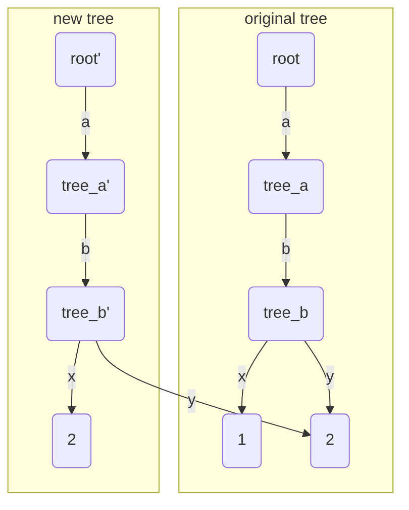
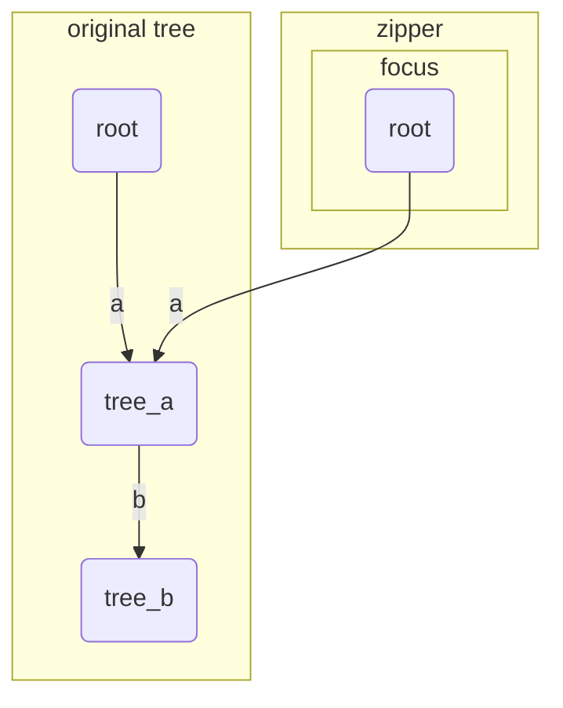
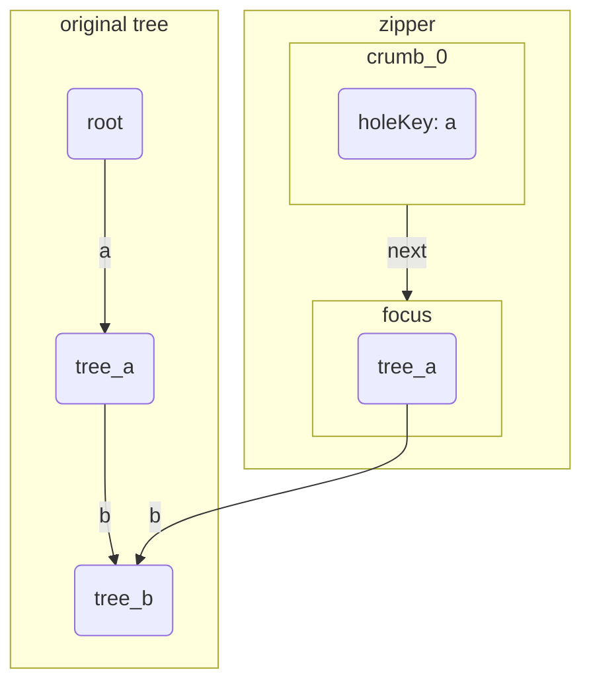
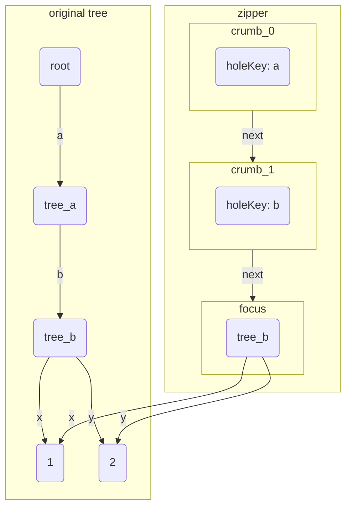
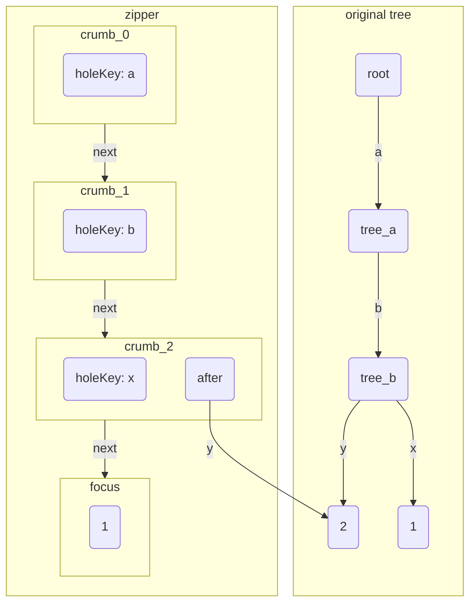
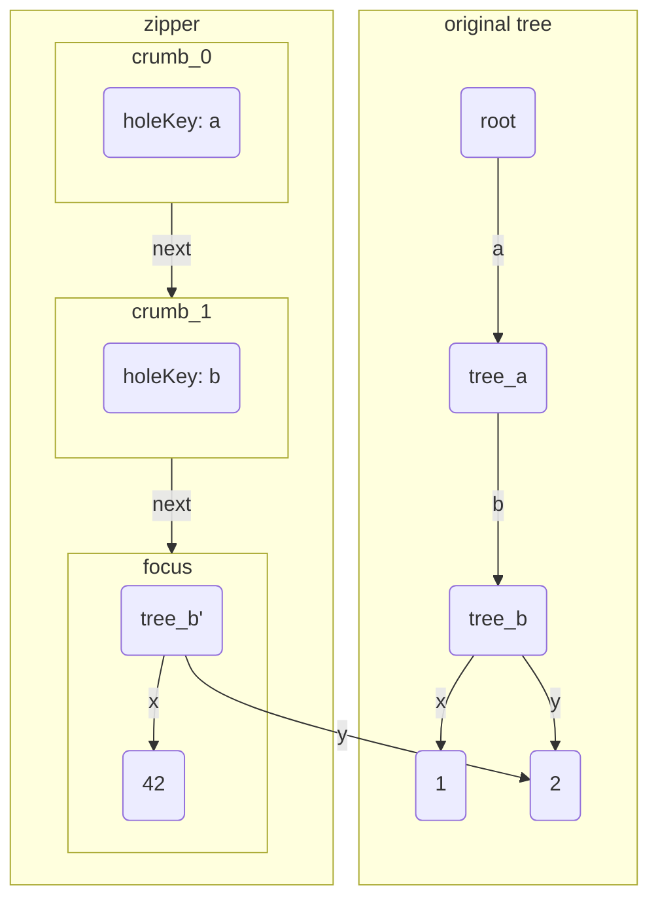

When working with tree data structures, we often need to navigate to a specific node and modify it. It is
straightforward in imperative languages, but it can be tricky in functional languages due to immutability. This post
will explain how to navigate and modify tree data structures in functional languages using a technique called
**Zippers**.

## Simple JSON query language

Suppose we are implementing a simple JSON query tool which has similar syntax to `jq`. The query language allows us to
access and modify values in a JSON object.

The syntax of the query language is as follows:

- `.field` to access a field of an object and focus on the field value
- `=` to modify the current value to a new value
- `|` to chain operations together
- `with_cursor(filter, query)` to execute a query with the current focus node as the root node 

It is quite straightforward to implement the query language in an imperative language. If we parse the JSON object into
a tree data structure which has a pointer to the parent node, we can easily navigate to the target node and move up to
the parent node. However, in a functional language like Haskell, we cannot have pointers to the parent node because of
immutability. We need a different approach to navigate and modify the tree data structure.

### Example

Suppose we have the following JSON object:

```json
{
  "a":{
    "b":{
        "x":1,
        "y":2
    }
  }
}
```

We have the following two queries that do the same thing but with different syntax:

```
.a.b.x = 42 | .a.b.y = 43

with_cursor(.a.b, .x = 42 | .y = 43)
```

We will use the example to explain how to implement the query language in Haskell, and how to use Zippers to navigate
and modify the tree data structure efficiently.

## Navigating and Modifying Trees in Functional Languages

### Persistent data structure

In Haskell, data structures are typically immutable. To modify a node in a tree, we need to create a new tree with the
modified node. The unchanged parts of the original tree can be shared between the original and the new tree, which is
called a **persistent data structure**.

Let's define a simple tree data structure to represent the only subset of JSON that we need for our query language:

```haskell
data Tree
  = Leaf Int
  | Tree [(String, Tree)]
```

After parsing the DSL code, we create a tree like the following:

```haskell
root :: Tree
root = Tree [("a", Tree [("b", Tree [("x", Atom 1), ("y", Atom 2)])])]
```

### First query implementation

The first query `.a.b.x = 42 | .a.b.y = 43` can be implemented by accessing the target node and modifying it, then
accessing another target node through the modified root node and modifying it again.

To access a node, we recursively follow the path from the root to the target node and recursively create new nodes along
the way. The unchanged nodes are shared between the original tree and the new tree. The time complexity of the
`access` function is `O(depth(node))`, where `depth(node)` is the depth of the target node in the tree.

```haskell
access :: [String] -> (Tree -> Tree) -> Tree -> Tree
access [] f t = f t
access (k : ks) f (Tree ts)
  | let (before, rest) = break ((== k) . fst) ts
  , ((_, v) : after) <- rest =
      let modifiedChild = access ks f v
       in Tree (before ++ (k, modifiedChild) : after)
access _ _ _ = error "Invalid path to access"
```

In the `access` function, we first check if the path is empty. If it is, we apply the modification function `f` to the
current node. If the path is not empty, we look for the child node with the key `k`. If we find it, we recursively call
`access` on the child node with the remaining path `ks`. After we get the modified child node, we create a new tree node
with the modified child node and the unchanged siblings, and return the new tree.


#### Example of `access`

Suppose we modify the "x" node to 1 with `access ["a", "b", "x"] (const $ Atom 42) root`, the new tree and the original
tree would look like the following:



In the diagram, the `tree_a` stands for a `Tree` node that is a child of the root node with key "b". The `tree_a'` is a
modified version of `tree_a` with the modified child node "x". The `root'` is a modified version of the original root
node with modified nodes. So is `tree_b'`.

From the diagram, we can see that the modified node "x" is a new node with value 1, and its parent node "b" is also a
new node that shares the unchanged child node "a" with the original tree.

#### Query execution

The whole query can be translated to the following Haskell code:

```haskell
( access ["a", "b", "x"] (const $ Atom 2)
    . access ["a", "b", "y"] (const $ Atom 3)
)
  root
```

`.a.b.x = 42` is translated to `access ["a", "b", "x"] (const $ Atom 42)`, which evaluates to a function that takes a
tree and returns a new tree, and so on. The `|` operator is translated to function composition, which is `.` in Haskell.
The two `access` functions are composed together, and the resulting function is applied to the original tree `root` to
get the modified tree.

If there are `N` modifications in the query, the time complexity of the whole query is `O(N * depth(tree))`.

#### Parent pointer

It might be tempting to add a parent pointer to the tree data structure to make it easier to navigate upwards like in an
imperative language. However, in functional languages, this is almost impossible because of immutability. In Haskell, it
can be done by using the lazy evaluation feature, but it is too complicated and not recommended. See [Tying the knot](https://wiki.haskell.org/Tying_the_knot) for more details.

### Second query implementation

The query `with_cursor(.a.b, .x = 42 | .y = 43)` introduces a cursor that allows us to focus on a specific node in
the tree and execute a query with the focused node as the root node. The `with_cursor` query can be implemented by using
a technique called **Zippers**.

#### Zippers

Zippers are a powerful technique for navigating and modifying persistent data structures like trees. They allow us to go
to parent node or to a specific child node in `O(1)` time. The idea is close to the stack approach, but instead of
storing pointers to the ancestor nodes, we store the **context** of the current node.

```haskell
data Zipper = Zipper
  { focus :: Tree
  , breadcrumbs :: [Crumb]
  }
  
data Crumb = Crumb
  { before :: [(String, Tree)]
  , holeKey :: String
  , after :: [(String, Tree)]
  }
```

A `Zipper` consists of:
- the **currently focused tree node**
- a list of **breadcrumbs** that stores the path from the root to the current node.

A `Crumb` looks like a `Tree`, except for one `Tree` is taken away, which is the next node we have gone down to from the
`Crumb`. The `holeKey` stores the key of the removed node, `before` contains the preceding siblings, and `after`
contains the following siblings.

```haskell
emptyZipper :: Tree -> Zipper
emptyZipper t = Zipper t []
```

We create a Zipper focusing on the root:



In the diagram, the focus node is a copy of the original root node, and the breadcrumb stack is empty because we are at the root node.

#### Move down

```haskell
goDown :: String -> Zipper -> Zipper
goDown k (Zipper (Tree ts) bs)
  | (l, (_, v) : r) <- break ((== k) . fst) ts = Zipper v (Crumb l k r : bs)
goDown k (Zipper f _) = error $ "Cannot go to child '" ++ k ++ "' of tree: " ++ show f
```

Moving downward creates a `Crumb` from the parent node by extracting the target child, which becomes the new focus node.
The `Crumb` is then pushed onto the breadcrumb stack.

We go down to "a", the Zipper would look like the following:



In the diagram, the `crumb_0` is the top `Crumb` in the breadcrumb stack. The `holeKey` indicates that the "a" node is
taken away from the root node, and the `before` and `after` fields are empty because there is no sibling of "a". The focus
node is identical to the "a" node in the original tree.

Then go down to "b": 



The focus node is identical to the "b" in the original tree. The `crumb_1` looks similar to `tree_a`, but the "b" node
is taken away and replaced with a hole, which is indicated by the `holeKey` field. The `before` and `after` fields are
empty.

Now we go down to "x", the Zipper would look like the following:



The newly added `crumb_2` indicates that the "x" node is taken away from the "b" node, and the "y" node is a sibling of
"x", so it is stored in the `after` field of the `Crumb`. The focus node is identical to the "x" node in the original
tree.

#### Focus modification

Now we modify the value of "x" to 1. We just call the `modify` function on the focus node:

```haskell
modifyZipper :: (Tree -> Tree) -> Zipper -> Zipper
modifyZipper f (Zipper t bs) = Zipper (f t) bs
```

Modifying the focus node does not change the breadcrumbs, nor does it return a new root node. So the time complexity of
`modifyZipper` is `O(1)`.

We modify the "x" node to 42. Now in the zipper, the focus node is a new node with value 42.

#### Move up

```haskell 
goUp :: Zipper -> Zipper
goUp (Zipper t (Crumb l key r : bs)) = Zipper (Tree (l ++ (key, t) : r)) bs
goUp (Zipper _ []) = error "Already at the top"
```

Moving upward is a reverse process of moving downward. It **reassembles the tree** by filling the hole in the Crumb with
the current focus node, popping the Crumb from the list of breadcrumbs, and making the reassembled tree the new focus
node. It is an `O(1)` operation.

Now we go up, the Zipper would look like the following:



In the above diagram, the new focus node is created by filling the hole in the crumb with the modified "x" node which
has value 42. The new focus node shares the unchanged child node "y" with the original "b" node.

#### access with Zipper

Unlike `access` which returns a new root node, `accessZ` goes to the target node, applies the function to the focus
node, and then goes back to the same position in the tree. The time complexity of `accessZ` is `O(depth(node))` too, but
the depth is relative to the focus node, not the root node.

```haskell
accessZ :: [String] -> (Zipper -> Zipper) -> Zipper -> Zipper
accessZ [] f z = f z
accessZ (k : ks) f z = accessZ ks f (goDown k z) & goUp

(&) :: a -> (a -> b) -> b
x & f = f x
```

In the `accessZ` function, we first check if the path is empty. If it is, we apply the modification function `f` to the
current Zipper. If the path is not empty, we go down to the child node with key `k`, recursively call `accessZ` on the
child node with the remaining path `ks`, and then go back up to the original position.

The `(&)` operator is a reverse function application operator, which allows us to write the operand before the function.

#### with_cursor implementation

We can implement the `with_cursor` query by using `accessZ` to navigate to the target node, apply the modification, and
then go back to the root node. The `withCursor` function takes a path to the target node, a modification function that
takes a Zipper and returns a modified Zipper, and the original tree. It returns a new tree with the modifications
applied.

```haskell
withCursor :: [String] -> (Zipper -> Zipper) -> Tree -> Tree
withCursor path f t = focus $ accessZ path f (emptyZipper t)
```

The `accessWCursor` function is a helper function that works similarly to `access`, which allows us to modify a tree
node.

```haskell
accessWCursor :: [String] -> (Tree -> Tree) -> Zipper -> Zipper
accessWCursor path f = accessZ path (modifyZipper f)
```

#### Query execution

The second query `with_cursor(.a.b, .x = 42 | .y = 43)` will be translated to the following code:

```haskell
withCursor
  ["a", "b"]
  (accessWCursor ["x"] (const $ Atom 42) . accessWCursor ["y"] (const $ Atom 43))
  root
```

It uses `withCursor` to navigate to the "b" node, then setting the "b" node as the cursor, it modifies the "x" node and
the "y" node with `accessWCursor`.

If there are `N` modifications that are close to the cursor node, the time complexity of the whole query is `O(depth(node) + N)`.

## When to use Zippers

Under workloads that require a lot of value lookups during navigation, Zippers alone might not be optimal. Even though
the time complexity of every navigation operation is `O(1)`, each operation allocates memory. If we need to constantly
navigate to a node and then fetch the value of the node, the memory allocation can be a bottleneck.

We can have some optimizations:

- build a cache that maps from the path to the node to the node value, and use the Zipper only for updates. This way we
  can minimize memory allocation.
- create a function to look up value directly in the Zipper without modifying the Zipper. Zipper has all the information
  needed to look up the value of any node in the tree. The time complexity of this lookup function is `O(depth(node))`,
  but it does not allocate memory, so it can be more efficient than navigating to the node and then fetching the value.

### Complexity of `Crumb` implementation

If the tree has different types of nodes, for example an AST tree, the `Crumb` implementation can be more complicated.
For each different type of node, we need to define how to create a hole in the node and how to reassemble the node when
going up. This can lead to a lot of boilerplate code and make the implementation more error-prone.

For example, if we have the following Value tree:

```haskell
data Value = Atom String
         | List [Value]
         | Map [(String, Value)]
         | BinOp String Value Value
         | UnOp String Value
```

For each type of node that can have children, we need to define a complicated `Crumb`:

```haskell
data ValueCrumb = ListCrumb Int [Value] [Value]
                | MapCrumb String [(String, Value)] [(String, Value)]
                | BinOpLeftCrumb String Value
                | BinOpRightCrumb String Value
                | UnOpCrumb String
```

## Conclusion

Zippers are a powerful technique for navigating and modifying persistent data structures like trees. They allow us to go
to parent node or to a specific child node in `O(1)` time. However, zipper implementation can become complex, especially
for trees with heterogeneous node types. Additionally, under workloads requiring frequent value lookups during
navigation, zippers alone may not be optimal due to memory allocation overhead.

## Further reading

- [Learn You a Haskell for Great Good!](https://learnyouahaskell.github.io/zippers.html)  